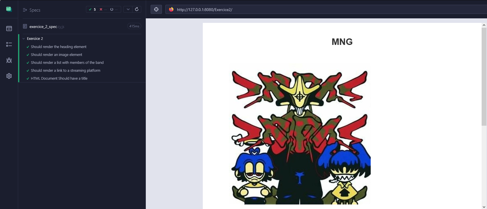
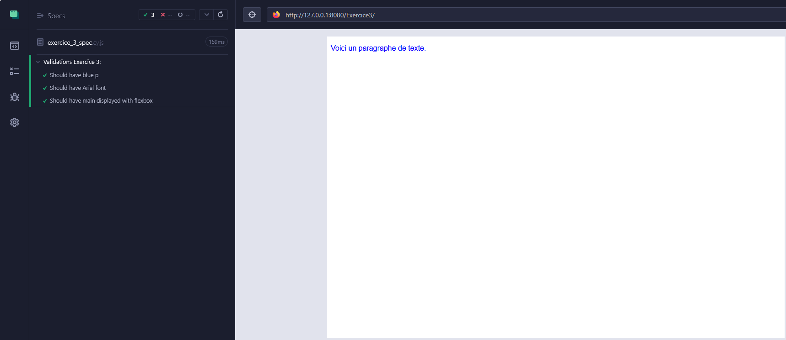
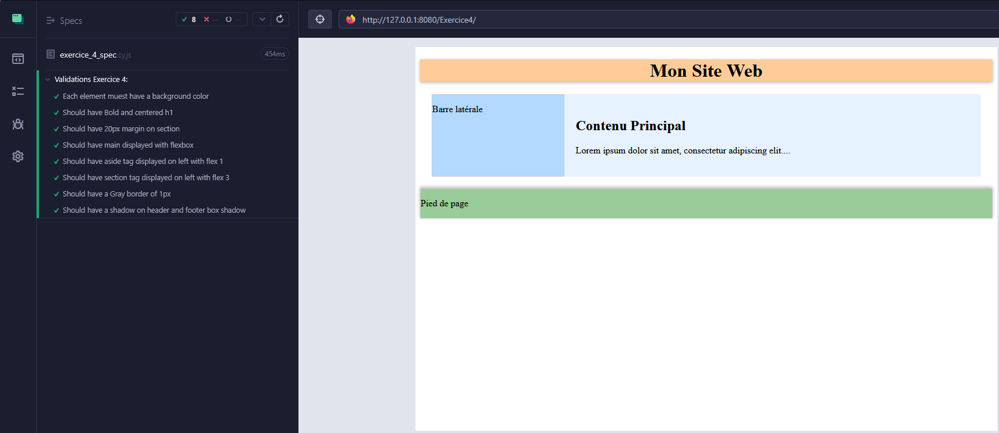
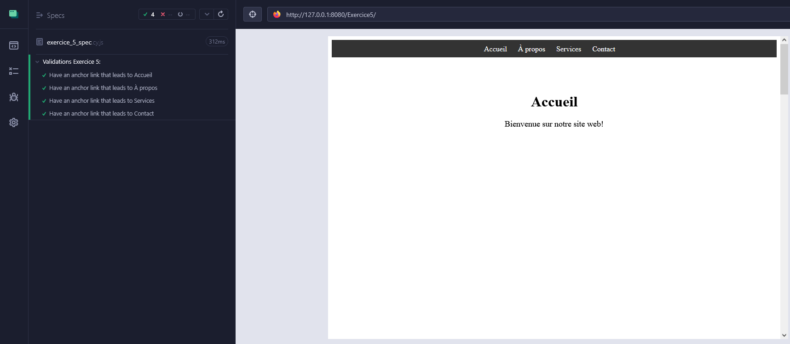
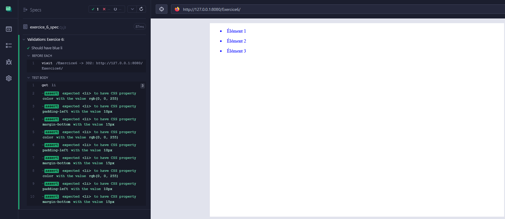
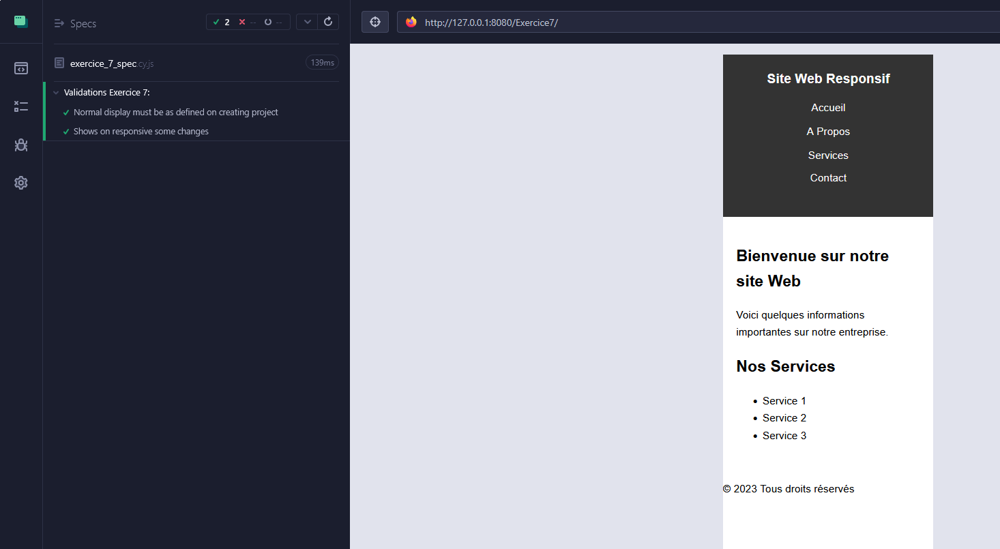
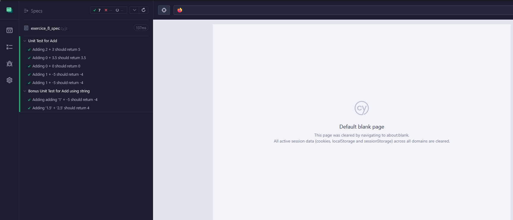
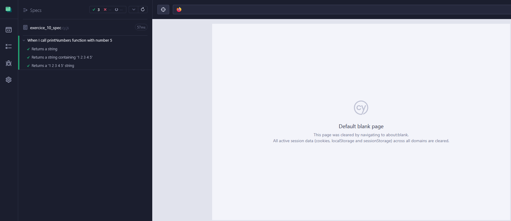

# Projet 5 : Testez vos compétences, les langages du web

 Pour commencer le projet, lancez la commande `npm install` qui installera les dépendances du projet. 
 
Vous pourrez ainsi réaliser les différents exercices. 

Pour vérifier que votre exercice est correctement réalisé vous n'avez qu'à lancer la commande `npm start` puis la commande `npm run test`. 
Vous verrez alors s'afficher l'application `Cypress`. 
Sélectionnez `E2E Testing` puis sélectionnez le navigateur dans lequel vous voulez lancer vos tests. 

Si votre code est correct alors les tests seront décrits en vert. 

Bon entraînement !

Résultats : 

 - Exercice 1 : 

- Exercice 2 :

- Exercice 3 :

- Exercice 4 :

- Exercice 5 :

- Exercice 6 :

- Exercice 7 :

- Exercice 8 :

- Exercice 9 :

- Exercice 10 :

